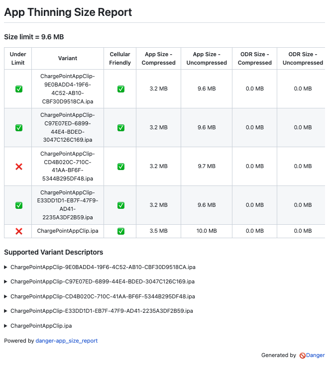
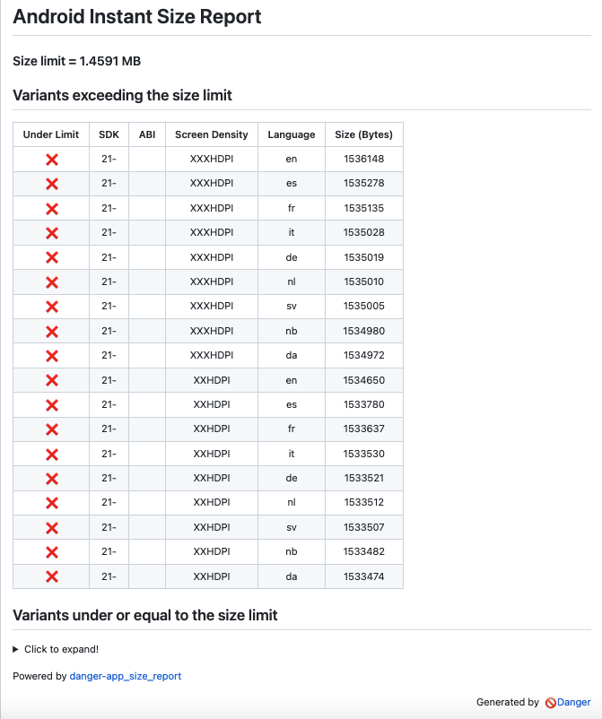

# danger-app_size_report

A [Danger](https://github.com/danger/danger) plugin for reporting iOS and Android app size violations.

## Installation

    $ gem install danger-app_size_report

## Usage

### `flag_ios_violations`

Report **iOS** app size violations given a valid App Thinning Size Report. A valid [App Thinning Size Report](https://developer.apple.com/documentation/xcode/reducing-your-app-s-size) must be passed to the plugin for accurate functionality.

    // Dangerfile

    report_path = "/Path/to/AppSizeReport.txt"
    app_size_report.flag_ios_violations(
        report_path,
        build_type: 'App',
        limit_size: 4,
        limit_unit: 'GB',
        fail_on_warning: false
    )

The list of variants with their sizes and any violations will be displayed in the PR report as seen below. Supported variant descriptors are placed under collapsible sections.

  

#### Parameters

- `report_path` [String, required] Path to valid App Thinning Size Report text file.
- `build_type` [String, optional] [Default: 'App'] Specify whether the report corresponds to an App or an App Clip.
  - Supported values: 'App', 'Clip'
- `limit_size` [Numeric, optional] [Default: 4] Specify the app size limit.
- `limit_unit` [String, optional] [Default: 'GB'] Specific the unit for the given size limit.
  - Supported values: 'KB', 'MB', 'GB'
- `fail_on_warning` [Boolean, optional] [Default: false] Specify whether the PR should fail if one or more app variants exceed the given size limit. By default, the plugin issues a warning in this case.

### `report_json`

Returns a JSON string representation of the given iOS App Thinning Size Report.

    // Dangerfile

    report_path = "/Path/to/AppSizeReport.txt"
    app_size_json = app_size_report.report_json(report_path)

#### Parameters

- `report_path` [String, required] Path to valid App Thinning Size Report text file.

### `flag_android_violations`

Report <b>Android</b> app size violations given a valid Android App Bundle (AAB). 

    // Dangerfile

    aab_path = "/Path/to/app.aab"
    ks_path = "/Path/to/keyStore"
    ks_alias = "KeyAlias"
    ks_password = "Key Password"
    ks_alias_password = "Key Alias Password"
    app_size_report.flag_android_violations(
        aab_path,
        ks_path,
        ks_alias,
        ks_password,
        ks_alias_password,
        screen_densities: ["MDPI", "HDPI", "XHDPI", "XXHDPI", "XXXHDPI"],
        languages: ["en", "de", "da", "es", "fr", "it", "nb", "nl", "sv"],
        build_type: 'Instant',
        limit_size: 4,
        limit_unit: 'MB',
        fail_on_warning: false
    )

The top 25 violations will be displayed in the PR report with any remaining violations and variants under the size limit placed under collapsible sections as seen below.

  

#### Parameters

- `aab_path` [String, required] Path to valid AAB file.
- `ks_path` [String, required] Path to valid signing key file.
- `ks_alias` [String, required] Alias of signing key.
- `ks_password` [String, required] Password of signing key.
- `ks_alias_password` [String, required] Alias Password of signing key.
- `screen_densities` [Array, optional] [Default: ["MDPI", "HDPI", "XHDPI", "XXHDPI", "XXXHDPI"]] Array of screen densities to check APK size.
- `languages` [Array, optional] [Default: ["en"]] Array of languages to check APK size
- `build_type` [String, optional] [Default: 'App'] Specify whether the report corresponds to an App or an Instant.
  - Supported values: 'App', 'Instant'
- `limit_size` [Numeric, optional] [Default: 150] Specify the app size limit.
- `limit_unit` [String, optional] [Default: 'MB'] Specific the unit for the given size limit.
  - Supported values: 'KB', 'MB', 'GB'
- `fail_on_warning` [Boolean, optional] [Default: false] Specify whether the PR should fail if one or more app variants exceed the given size limit. By default, the plugin issues a warning in this case.

## Contribute

1. Fork this repo.
2. Run `bundle install` to setup dependencies.
3. Run `bundle exec rake spec` to run the tests.
4. Use `bundle exec guard` to automatically have tests run as you make changes.
5. Make your changes.
6. Submit a pull request with your desired changes to be merged on review.

## More Info

[Open an issue](https://github.com/ChargePoint/danger-app_size_report/issues) if you have any questions!